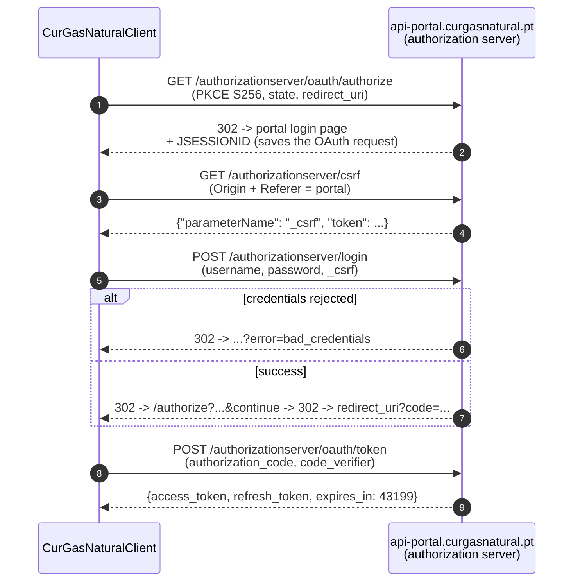
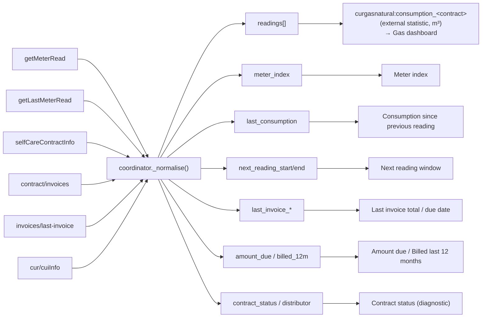
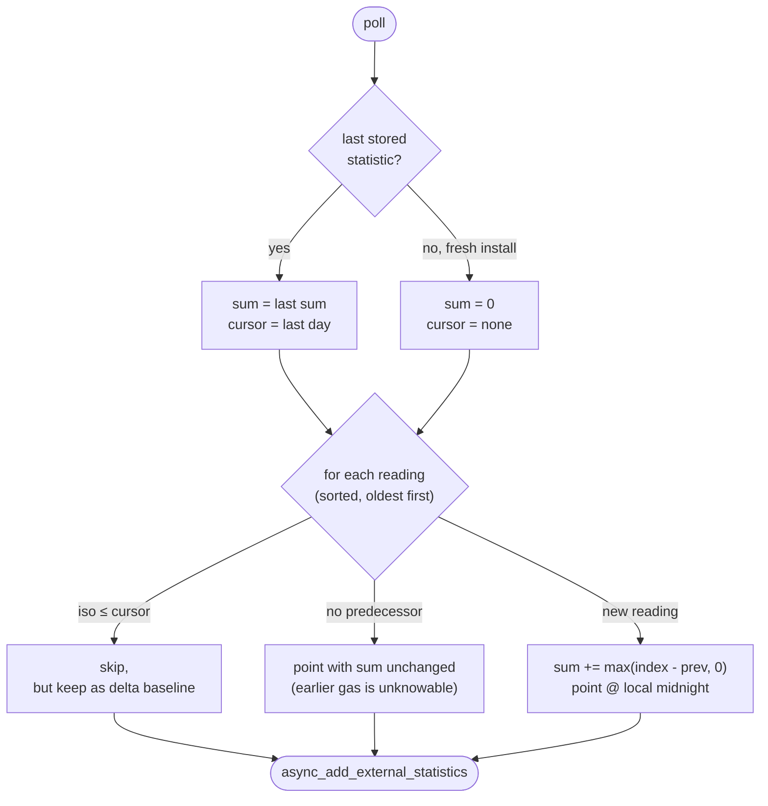

# CUR Gás Natural API (reverse-engineered, verified live)

The customer portal at `https://portal.curgasnatural.pt` is an **Angular (SAP
Spartacus)** front end over **SAP Commerce Cloud**. That is good news: instead of
scraping HTML, this integration calls the same **OCC v2 REST API** the portal
does, behind SAP's OAuth2 authorization server.

Everything below was captured from a live session (2026-07-31) and then
re-verified from a plain Python client. All identifiers in this document are
placeholders.

## Hosts

| Purpose | Host |
|---------|------|
| OAuth2 authorization server | `https://api-portal.curgasnatural.pt` |
| OCC v2 data API | `https://api.cfl9u3by7k-galpenerg3-p1-public.model-t.cc.commerce.ondemand.com` |
| Portal front end (the OAuth `redirect_uri` / `Origin`) | `https://portal.curgasnatural.pt` |

The OCC base URL comes from the portal's `<meta name="occ-backend-base-url">`,
and the base site is **`galpcurarea`** (`/occ/v2/galpcurarea/...`). The platform
also serves `galpcasa`, `galparea`, `galpbopartners` and `galpcur` — only
`galpcurarea` answers the self-care calls used here.

## Auth flow (OAuth2 authorization code + PKCE)

A **public client** — `client_id=galpCURUserClientLogin`, no client secret. The
`code_verifier` is what proves possession of the code.



### Step 1 — `GET /authorizationserver/oauth/authorize`

```text
?response_type=code
&client_id=galpCURUserClientLogin
&redirect_uri=https://portal.curgasnatural.pt/area-privada/iniciar-sessao
&scope=basic
&state=<random>
&code_challenge=<base64url(sha256(verifier))>
&code_challenge_method=S256
```

→ `302 Location: https://portal.curgasnatural.pt/area-privada/iniciar-sessao`

**This step is mandatory and must come first.** It is what creates the
server-side OAuth session. Calling `/csrf` before it answers
`400 {"error":"bad_request","error_description":"No OAuth client related to
request or custom login page URI not configured"}`.

### Step 2 — `GET /authorizationserver/csrf`

Requires `Origin: https://portal.curgasnatural.pt` **and**
`Referer: <redirect_uri>`. Without the `Referer` it answers
`400 "Login page configuration does not match the request"`.

```json
{"parameterName": "_csrf", "headerName": "X-CSRF-TOKEN", "token": "..."}
```

### Step 3 — `POST /authorizationserver/login`

Form-encoded `username`, `password`, `_csrf` (use the returned
`parameterName`). Send `Origin`, but **not** `Referer`.

The response is a 302 that chains back through
`/authorizationserver/oauth/authorize?...&continue` and lands on
`redirect_uri?code=...&state=...`. Follow it manually — the code is in the query
string, not the body.

Bad credentials short-circuit the chain:
`302 Location: .../iniciar-sessao?error=bad_credentials`.

### Step 4 — `POST /authorizationserver/oauth/token`

```text
grant_type=authorization_code
&client_id=galpCURUserClientLogin
&code=<code>
&redirect_uri=<same redirect_uri>
&code_verifier=<verifier>
```

```json
{"access_token": "<JWT>", "refresh_token": "...", "scope": "basic",
 "token_type": "Bearer", "expires_in": 43199}
```

The access token is a ~12 h JWT (`sub: gcur_<email>`). **`grant_type=refresh_token`
works**, so a routine poll costs one request rather than the whole four-step
dance.

### ⚠️ Header discipline is load-bearing

The authorization server's CORS filter is strict, and the failure is *delayed* —
it rejects the **next** request, which makes it easy to misdiagnose:

| Step | `Origin` | `Referer` | Getting it wrong |
|------|----------|-----------|------------------|
| `/authorize` | ✗ | ✗ | Sending `Origin` makes the following `/csrf` answer `403 Invalid CORS request` |
| `/csrf` | ✓ | ✓ (`redirect_uri`) | Omitting `Referer` → `400 Login page configuration does not match` |
| `/login` | ✓ | ✗ | — |
| `/token` | ✓ | ✗ | — |

This mirrors a real browser: `/authorize` is a top-level navigation (no
`Origin`), `/csrf` is an XHR from the portal page.

## Data endpoints

All under `/occ/v2/galpcurarea`, all with `Authorization: Bearer <token>` and
`?lang=pt&curr=EUR`.

| Method | Path | Body | Returns |
|--------|------|------|---------|
| GET | `/users/current/selfcare/clientInfo` | — | the account and its `associatedContracts` |
| POST | `/users/current/selfcare/selfCareContractInfo` | `{contractId}` | CUI, status, tier, billing, SEPA mandate |
| POST | `/users/current/selfcare/getMeterRead` | `{dateFrom, dateTo, contractId, energyType}` | **full reading history** (answers `201`) |
| POST | `/users/current/selfcare/getLastMeterRead` | same | recent readings **+ the next reading window** |
| GET | `/users/current/selfcare/cur/cuiInfo?cui=<CUI>` | — | the distributor behind that delivery point |
| POST | `/users/current/selfcare/contract/invoices` | `{contractId}` | invoice history |
| POST | `/users/current/selfcare/contract/invoices/last-invoice` | `{contractId}` | latest invoice + `toPayValue` |

`dateFrom`/`dateTo` are compact `yyyymmdd`; `energyType` is `GAS`.

An unauthenticated call answers
`401 {"errors":[{"type":"InsufficientAuthenticationError"}]}`.

> The response headers advertise `Access-Control-Allow-Headers:
> x-contract-authorization`, so a contract-scoped auth header exists somewhere in
> the platform. Nothing the portal does needs it, and nothing here sends it.

### Not exposed: the m³ → kWh conversion factor

The supplier bills **kWh**, derived from the m³ reading via the calorific value
(PCS) of the distribution network — printed on every invoice next to the reading
(`4 m³ x 11.20808 = 45 kWh`). **No endpoint found on this portal returns it**:
`getMeterRead` and `getLastMeterRead` carry volume only, and the invoice payloads
carry totals in euros with no consumption lines. The PDF behind
`printDocumentNumber` has it, but parsing a PDF for one number is a poor trade.

So the factor is a config option (`conversion_factor`), defaulting to 11.2. If a
future endpoint is found to expose it, that option should become a fallback.

## Response shapes (verified)

### `clientInfo`

```json
{"customerPk": "0000000000000", "email": "user@example.pt",
 "firstName": "Test", "lastName": "User",
 "associatedContracts": [
   {"guid": "aaaaaaaa-bbbb-cccc-dddd-eeeeeeeeeeee",
    "contractNumber": "34_00000000_00000000",
    "energyType": "GAS",
    "name": "R. EXAMPLE   1, 2, 3",
    "address": {"line1": "...", "postalCode": "0000-000", "town": "LISBOA"}}]}
```

`guid` is the `contractId` every other endpoint takes. Addresses come padded
with runs of spaces. An account may hold **several contracts** — one per delivery
point — which is why each is configured as its own entry.

### `getMeterRead` / `getLastMeterRead`

```json
{"deliveryPoint": "PT16050000000000XX",
 "divisionText": "Mercado Regulado",
 "idealPeriodBegin": "20260820",
 "idealPeriodEnd": "20260823",
 "readings": [
   {"date": "21-10-2025", "gv": "100", "originText": "Leitura do distribuidor"},
   {"date": "30-07-2026", "gv": "320", "maximumValue": "340",
    "minimumValue": "320 ", "originText": "Leitura do cliente"}]}
```

- **`gv` is the cumulative meter index in m³** — not a period total. It only ever
  goes up (verified across the whole history the portal returns).
- `date` is **day-first** `dd-mm-yyyy`; `idealPeriod*` is compact `yyyymmdd`.
- Values are **strings**, occasionally padded (`"320 "`).
- `originText` distinguishes `Leitura do distribuidor` from `Leitura do cliente`;
  both can report the *same* day, so duplicates must be collapsed.
- `idealPeriodBegin`/`idealPeriodEnd` (only on `getLastMeterRead`) are the window
  in which the next reading is expected.
- `minimumValue`/`maximumValue` (only on `getLastMeterRead`) bound what a
  client-submitted reading may be.

### `selfCareContractInfo`

```json
{"CUI": "PT16050000000000XX", "agreementStatus": "ACTIVE",
 "agreementType": "CUR", "contractNumber": "34_00000000_00000000",
 "energyType": "GAS", "tier": "ESCALAO_1", "directDebit": true,
 "deliveryPoints": [{"cui": "...", "deliveryPointType": "GAS", ...}],
 "billingFormat": "EMAIL", "nif": "000000000",
 "sepaMandate": {"iban": "...", "status": "ACTIVE"}}
```

Carries personal and banking data (NIF, IBAN, address). Only the non-sensitive
fields are surfaced as entities; **none of it is ever logged**.

### `invoices` / `last-invoice`

```json
{"documentFiscalNumber": ["FT K0000/00000000000"],
 "documentNumber": ["000000000000"],
 "emissionDate": "2026-07-23T00:00:00+0000",
 "dueDate": "2026-08-17T00:00:00+0000",
 "startBillingPeriod": "2026-06-21T00:00:00+0000",
 "endBillingPeriod": "2026-07-20T00:00:00+0000",
 "paymentStatus": "PENDING_PAYMENT",
 "hasDirectDebit": true, "failedDirectDebit": false,
 "totalValue": "12.34", "toPayValue": "12.34"}
```

- Amounts are **strings**; dates carry a meaningless midnight-UTC time and a
  `+0000` offset **without a colon**.
- `paymentStatus` seen live: `PAID`, `PENDING_PAYMENT`.
- `toPayValue` appears only on `last-invoice`.
- Number fields are single-element **arrays**.

### `cur/cuiInfo`

```json
{"title": "Lisboagás Comercialização, S.A.",
 "description": "M.C.R.C de Lisboa", "address": "...", "phone": "..."}
```

The CUR entity for the delivery point — used as the HA device's manufacturer.

## Endpoint → entity mapping



## Gas dashboard note

`gv` is a genuine cumulative index, which is exactly what long-term statistics
want — but the data is **backdated and sparse**: a reading dated the 20th only
appears days later, and the distributor reads roughly monthly. A live
`total_increasing` sensor would therefore attribute a whole month's gas to the
poll hour.

So `statistics.py` imports each reading as an hourly **external statistic**
timestamped at that reading's **local midnight**, with `sum` advanced by the
delta between consecutive readings. Consumption then lands on the day the meter
was actually read. One bar per reading is all the resolution this API offers; the
delta is deliberately *not* spread across the intervening days, because that
would be invented detail.



Clamping the delta at zero keeps `sum` monotonic if a meter is ever replaced and
the index restarts near zero.

> Credentials, tokens and the captured CUI/NIF/IBAN are per-account and must
> never be committed. Use placeholders in tests and docs, as above.
