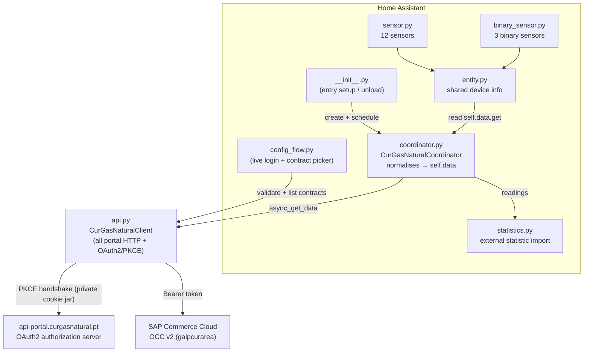
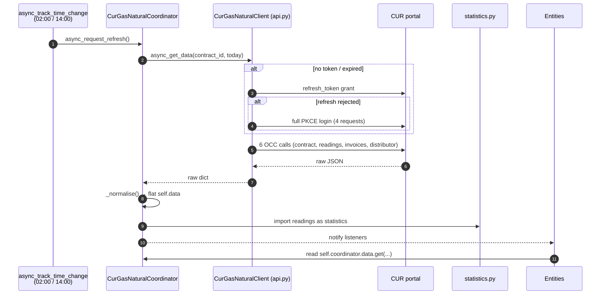
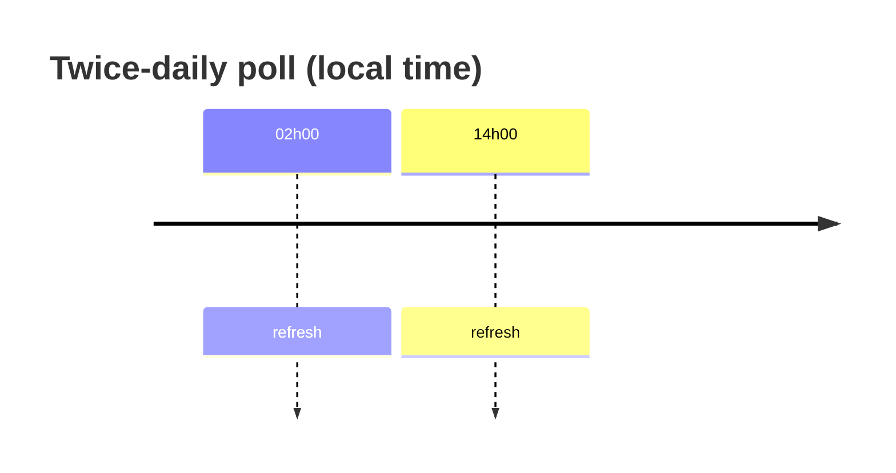
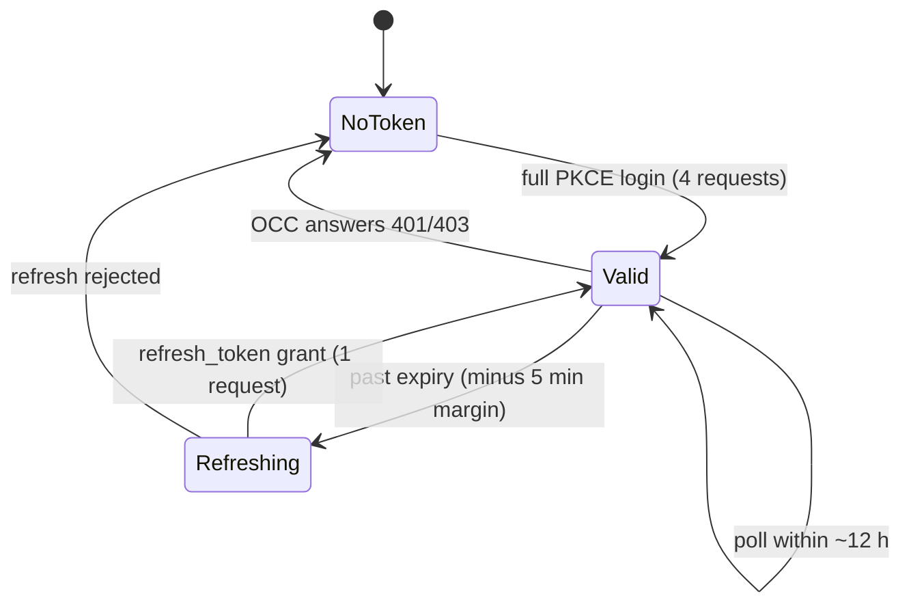

# Architecture

CUR Gás Natural is a **cloud polling** integration. Home Assistant signs into the
CUR customer portal twice a day and reads its OCC v2 REST API — the same API the
portal's own Angular front end uses.

One config entry per **contract** (delivery point), so an account with several
supplies gets one device, one entity set and its own pair of statistics.

## Component overview

## Data flow

## Components

| File | Purpose |
|------|---------|
| `api.py` | HTTP client: private cookie jar, OAuth2 authorization-code + PKCE handshake, token refresh, OCC calls. **All portal network logic lives here.** |
| `coordinator.py` | `DataUpdateCoordinator`; normalises the raw self-care payloads into a flat `self.data`, then hands the readings to `statistics.py`. |
| `statistics.py` | Imports three long-term **external statistics** per contract: m³ and kWh from the readings, plus billed cost from the invoices. |
| `entity.py` | Shared `CoordinatorEntity` base: unique ids and the per-contract device. |
| `const.py` | `Final`-typed constants: config keys, hosts, endpoints, entity keys, `coordinator.data` keys, `POLL_HOURS`, the conversion-factor bounds. |
| `config_flow.py` / `__init__.py` | Setup UI (live login, then a contract picker) / entry point (registers the twice-daily schedule). |
| `sensor.py` / `binary_sensor.py` | Entities, declared as description tables. All state read from `coordinator.data`; `None` when missing. |

## Entities

| Entity | `coordinator.data` key | Unit | State class |
|--------|------------------------|------|-------------|
| Meter index | `meter_index` | m³ | `total` |
| Meter index (energy) | `meter_index_energy` | kWh | `total` |
| Consumption since previous reading | `last_consumption` | m³ | `measurement` |
| Consumption since previous reading (energy) | `last_consumption_energy` | kWh | `measurement` |
| Last reading date | `last_reading_iso` | — | — (`date`) |
| Next reading window start / end | `next_reading_start` / `_end` | — | — (`date`) |
| Last invoice total | `last_invoice_total` | € | `total` |
| Last invoice due date | `last_invoice_due` | — | — (`date`) |
| Amount due | `amount_due` | € | `total` |
| Billed last 12 months | `billed_12m` | € | `total` |
| Contract status *(diagnostic)* | `contract_status` | — | — |
| Invoice pending payment *(binary)* | `invoice_pending` | — | — |
| Direct debit failed *(binary, problem)* | `direct_debit_failed` | — | — |
| Service available *(binary, diagnostic, off by default)* | `available` | — | — |

The sensors above are **informative**. The Gas dashboard is instead fed by the
**external statistics** imported from `readings` (see [`API.md`](API.md) and
`statistics.py`), of which there are two per contract:

| Statistic id | Unit | Maintained | For |
|--------------|------|-----------|-----|
| `curgasnatural:consumption_<contract>` | m³ | rewritten over the polled window | What the meter counted |
| `curgasnatural:energy_<contract>` | kWh | derived from volume | What the supplier bills |
| `curgasnatural:cost_<contract>` | currency | append-only | `stat_cost` for the Gas dashboard |

The volume series is the source of truth. The energy series is the volume series
scaled by `conversion_factor`, **re-derived on every poll** so a corrected factor
repairs the whole history instead of leaving the old one baked into everything
written before the change. Only one of the two should be wired into the Gas
dashboard, or consumption is double-counted.

The cost series exists because Home Assistant rejects `entity_energy_price` /
`number_energy_price` on an external statistic. It carries the totals the supplier
invoiced — already inclusive of fixed terms and VAT — each booked at the end of the
period it bills. A non-positive total (a credit note) is clamped to zero: a falling
`sum` would read as a meter reset and render as a large negative bar.

### Why a statistic, not a `total_increasing` sensor

The portal does expose a cumulative meter index (`gv`), but readings are
**backdated and sparse** — a reading dated the 20th surfaces days later, and the
distributor reads roughly monthly. A live `total_increasing` sensor changes value
only at the poll hour, so the Gas dashboard (which derives consumption from
hourly deltas) would pile a whole month's gas onto that one hour.

Importing the readings as statistics timestamped at **local midnight** puts the
consumption on the days it was burnt instead.

### Why each reading's gas is spread over the days it covers

A reading gives the meter index for one instant, but the consumption it implies
belongs to the whole period since the previous reading. Dating the entire delta at
the reading day made calendar months read wrong, because the Gas dashboard diffs
`sum` at month boundaries: a reading taken on 11 July carried 30 days of gas, two
thirds of it June's, so July reported 7 m³ where about 4 were actually burnt in
July.

So `build_statistic_points` writes **one point per calendar day** between two
readings, splitting the delta evenly and interpolating the index. An even split is
an approximation — gas use is not uniform — but a much smaller one than crediting
June's heating to July, and the reading days themselves stay exact.

That is why the volume series is **rewritten** over the polled window rather than
appended to: `sum` is anchored on the total already stored for the oldest reading
the portal still returns (`_anchor_sum`) and recomputed from there. History older
than the window is left untouched, `sum` stays monotonic, and a backdated reading
arriving late now repairs the days it covers instead of dumping its gas on the day
it showed up.

## Polling schedule

`update_interval` is `None` — there is no tight periodic loop. The coordinator
registers two fixed daily refreshes via `async_track_time_change` at the hours in
`POLL_HOURS` (`02:00` / `14:00`). Readings change at most a few times a month, so
more frequent polling would add nothing.

## Token lifecycle

A 401/403 from OCC drops the token and retries the call exactly once with a fresh
login; a second rejection fails the update.

## Rules

1. **All portal network logic in `api.py`.** The coordinator and entities never
   talk HTTP directly.
2. **All state in the coordinator.** Entities only read
   `self.coordinator.data.get(...)` and return `None` for missing values.
3. **The client owns its own cookie jar** — never the shared HA session. The
   PKCE handshake is stateful, so it also clears cookies before each login.
4. **Poll twice a day** (`02:00` / `14:00`) via `async_track_time_change`.
5. **Never log credentials, tokens, or the CUI/NIF/IBAN** the contract payload
   carries.
6. **Log via `_LOGGER`**, never `print()` (ruff `T20`).
7. Refresh, then re-login, then fail — in that order, once each.
8. A statistics failure must never fail the poll.
